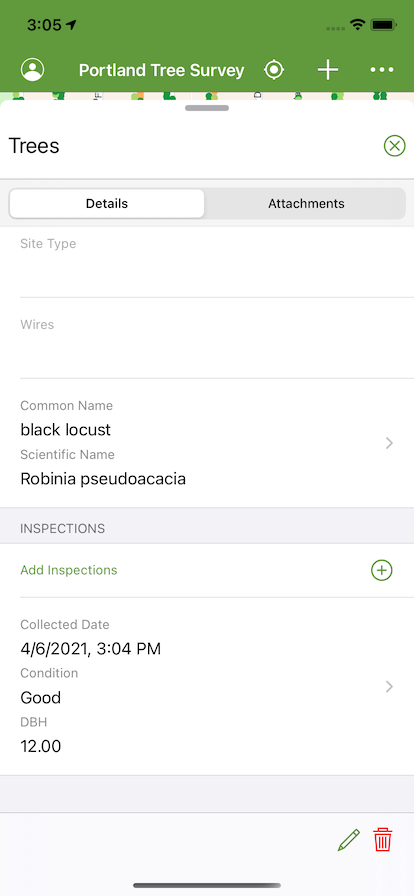
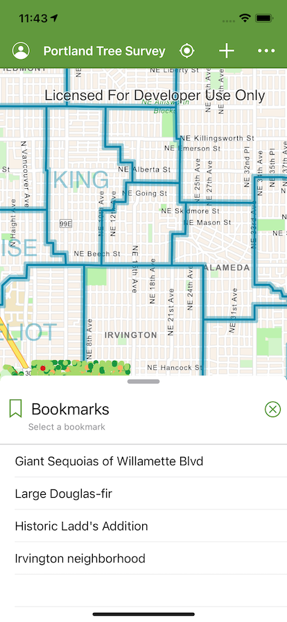

# Data Collection iOS

<!-- MDTOC maxdepth:6 firsth1:0 numbering:0 flatten:0 bullets:1 updateOnSave:1 -->

- [Features](#features)   
- [Best practices](#best-practices)   
- [Detailed documentation](#detailed-documentation)   
- [Get started](#get-started)   
   - [Fork the repo](#fork-the-repo)   
   - [Clone the repo](#clone-the-repo)   
   - [Grant permission](#grant-permission)   
   - [Configuring a remote for a fork](#configuring-a-remote-for-a-fork)   
   - [Configure the app](#configure-the-app)   
      - [1. Register an application](#1-register-an-application)   
      - [2. Configure the project](#2-configure-the-project)   
      - [3. Configure app secrets](#3-configure-app-secrets)   
- [Learn More](#learn-more)   
- [Requirements](#requirements)   
- [Contributing](#contributing)   
- [MDTOC](#mdtoc)   
- [Licensing](#licensing)   
   - [3rd Party Component Licensing](#3rd-party-component-licensing)   

<!-- /MDTOC -->
---

[Data Collection for iOS](https://developers.arcgis.com/example-apps/data-collection-ios/) shows how a robust application can be built around the ArcGIS Platform using the ArcGIS Runtime SDK for iOS and Swift. It demonstrates best practices around some simple but key functionality of the ArcGIS Runtime. Using your organization's web maps, you can use Data Collection as is, or extend it to meet your specific needs.

| Map | Portal | Pop-up | Attachments |
| --- | ------ | ------ | ----------- |
|  |  |  |  |

| Collect | Map Content | Bookmarks | Layers |
| ------- | ----------- | --------- | ------ |
|  |  |  |  |

## Features

* Taking your web map and data offline
* Editing your data both offline and online
* Synchronizing offline edits
* Viewing and editing your data with Popups
* Working with Features, Popups and PopupManagers
* Editing and querying Feature Tables
* Working with related records
* Identifying map features
* Portal authentication with OAuth
* Using the World Geocoder service
* Using Popup configuration to drive app behavior

## Best practices

The project also demonstrates some patterns for building real-world apps around the ArcGIS Runtime SDK.

* Map-centric UI design
* ArcGIS asynchronous service pattern
* Swift class extensions
* Swift KVO & NotificationCenter state handling

## Detailed documentation

Read the [docs](./docs/README.md) for a detailed explanation of the application, including its architecture and how it leverages the ArcGIS platform, as well as how you can begin using the app right away.

## Get started

Make sure you've installed Xcode and the ArcGIS Runtime SDK for iOS and that they meet these [requirements](#requirements).

### Fork the repo

**Fork** the [Data Collection](https://github.com/Esri/data-collection-ios/fork) repo.

### Clone the repo

Once you have forked the repo, make a clone.

```bash
git clone --recursive [URL to forked Git repo]
```

> Make sure to use the "recursive" option to ensure you get the **ArcGIS Runtime Toolkit** submodule

If you've already cloned the repo without the submodule, you can load the submodule using

```bash
git submodule update --init
```

Change into the root repo directory.

```bash
cd data-collection-ios
```

### Grant permission

The project uses a bash program named `masquerade` in a custom build rule to conceal app secrets in versioned source code. Grant `masquerade` executable permissions.

```bash
chmod +rwx data-collection/scripts/masquerade
```

To learn more about `masquerade`, consult the app's [documentation](./docs#app-configuration).

### Configuring a remote for a fork

If you make changes in the fork and would like to [sync](https://help.github.com/articles/syncing-a-fork/) those changes with the upstream repository, you must first [configure the remote](https://help.github.com/articles/configuring-a-remote-for-a-fork/). This will be required when you have created local branches and would like to make a [pull request](https://help.github.com/articles/creating-a-pull-request) to your upstream branch.

1. Specify a new remote upstream repository that will be synced with the fork.

  ```bash
  git remote add upstream https://github.com/Esri/data-collection-ios.git
  ```

2. Verify the new upstream is added.

  ```bash
  git remote -v
  ```

If there are changes made in the original repository, you can sync the fork to keep it updated with upstream repository.

1. In the terminal, `cd` to your local project repo.

2. Fetch the commits from the upstream repository.

  ```bash
  git fetch upstream
  ```

3. Checkout your fork's local master branch.

  ```bash
  git checkout master
  ```

4. Sync your local `master` branch with `upstream/master`.

  ```bash
  git merge upstream/master
  ```

  > Note, your local changes will be retained and your fork's master branch will be in sync with the upstream repository.

### Configure the app

#### 1. Register an application

The app uses OAuth to authenticate users to a web map hosted in your ArcGIS Portal. Register an application with the developers website to broker authentication between the app and your Portal.

1. Log in to [developers.arcgis.com](https://developers.arcgis.com) with either your ArcGIS Organizational Account or an ArcGIS Developer Account.
1. Create a [new application](https://developers.arcgis.com/applications/new).
1. Click the 'Authentication' tab.
1. Note the **Client ID**, we'll use it in a future step.
1. Add a new **Redirect URI**, `data-collection://auth`

> The **Client ID** configures the ArcGIS Runtime to show your users, during the login process, that the application was built by you and can be trusted.
>
> The **Redirect URL** configures the OAuth process to then return to your app once authentication is complete.

#### 2. Configure the project

Configure the project to access your organization's Portal and web map.

> If you would like to run the application using a demo data set maintained by Esri, you can ignore this step.

1. Open the project named `data-collection.xcodeproj` in Xcode.
1. Browse to the file named `AppConfiguration.swift` located in the directory named `data-collection`.
1. Configure the app with your organization's base portal domain by modifying the value of the property named `basePortalDomain`.
1. Configure the app with your organization's web map by modifying the value of the property named `webMapItemID`.

#### 3. Configure app secrets

As a best-practices principle, the project conceals app secrets from source code by generating and compiling an `AppSecrets.swift` source code file at build time using a custom build rule.

This build rule looks for a secrets file stored in the project directory, `$(PROJECT_DIR)/.secrets`.

1. Create a hidden secrets file in the project's root directory.

  ```bash
  touch data-collection/.secrets
  ```

2. Add your registered app's **Client ID** to the secrets file.

  ```bash
  echo ARCGIS_CLIENT_ID=your-client-id >> data-collection/.secrets
  ```

  > Replace 'your-client-id' with your app's **Client ID**.

3. _Optionally_ add your **License Key** to the secrets file. Licensing the app will remove the 'Licensed for Development' watermark. Licensing the app is optional in development but required for production. Acquire your license key from your [dashboard](https://developers.arcgis.com/dashboard).

  ```bash
  echo ARCGIS_LICENSE_KEY=your-license-key >> data-collection/.secrets
  ```

  > Replace 'your-license-key' with your **License Key**.

A Lite license is free and enables most of the capabilities required by this app, with the exception of offline editing and synchronizing offline edits back to a feature service. For offline editing and synchronizing, you need a Basic license. Visit the developer's website to learn more about [licensing your ArcGIS Runtime app](https://developers.arcgis.com/documentation/mapping-apis-and-location-services/licensing/license-your-app/) and the different [ArcGIS Runtime license levels](https://developers.arcgis.com/ios/license-and-deployment/license/).

To learn more about `masquerade`, consult the app's [documentation]](./docs#app-configuration).

## Learn More

Learn more about Esri open source apps [here](https://developers.arcgis.com/example-apps).

## Requirements

* [Xcode 11 and Swift 5](https://itunes.apple.com/us/app/xcode/id497799835?mt=12)
* [ArcGIS Runtime SDK for iOS](https://developers.arcgis.com/ios/latest/swift/guide/install.htm#ESRI_SECTION1_D57435A2BEBC4D29AFA3A4CAA722506A), version 100.10.
* [ArcGIS Runtime Toolkit for iOS](https://github.com/Esri/arcgis-runtime-toolkit-ios), version 100.10.
* To edit records or take a web map offline you will need an ArcGIS Online Organizational account, an ArcGIS Online Developer account or an ArcGIS Online account authenticated using a social login.
* To consume your own web map you will need an ArcGIS Online Organizational account.
* Device or Simulator running iOS 13.0 or later.

**Note:** Starting from the 100.8 release, the ArcGIS Runtime SDK for iOS uses Apple's Metal framework to display maps and scenes. However, Xcode does not support Metal based rendering in any version of iOS simulator on macOS Mojave. If you are developing map or scene based apps in these environments, you will need test and debug them on a physical device instead of the simulator.

**Note:** The 100.10 release of the ArcGIS Runtime SDK for iOS replaces the installed "fat framework" `ArcGIS.framework` with a new binary framework `ArcGIS.xcframework`.  It also changes the location of the installed framework file and removes the need for the `strip-frameworks.sh` Build Phase.  These changes have been incorporated in the lastest release of the *Data Collection app*.

## Contributing

Anyone and everyone is welcome to [contribute](https://github.com/esri/contributing). We do accept pull requests.

## MDTOC
Generation of this and other document's table of contents in this repository was performed using the [MDTOC package for Atom](https://atom.io/packages/atom-mdtoc).

## Licensing

Copyright 2018 Esri

Licensed under the Apache License, Version 2.0 (the "License"); you may not use this file except in compliance with the License. You may obtain a copy of the License at

[http://www.apache.org/licenses/LICENSE-2.0](http://www.apache.org/licenses/LICENSE-2.0)

Unless required by applicable law or agreed to in writing, software distributed under the License is distributed on an "AS IS" BASIS, WITHOUT WARRANTIES OR CONDITIONS OF ANY KIND, either express or implied. See the License for the specific language governing permissions and limitations under the License.

A copy of the license is available in the repository's [LICENSE](LICENSE) file.

For information about licensing your deployed app, see [License your app](https://developers.arcgis.com/ios/latest/swift/guide/license-your-app.htm).

### 3rd Party Component Licensing

Some great open source components are available out there for iOS developers. The following have been used in this project, with much gratitude to their authors.

* [SVProgressHUD](https://github.com/SVProgressHUD/SVProgressHUD) is licensed under the MIT License.
* [Alamofire/NetworkReachabilityManager](https://github.com/Alamofire/Alamofire/blob/master/Source/NetworkReachabilityManager.swift) is licensed under the MIT License.
