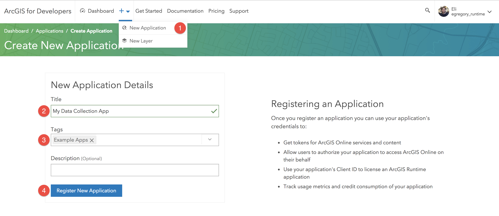
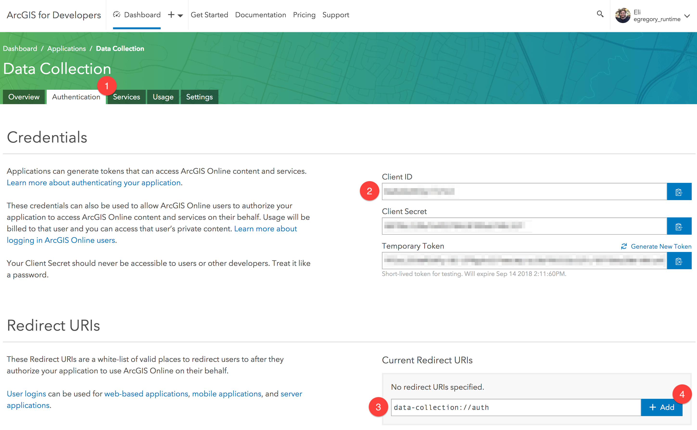

# Data Collection iOS

[Data Collection for iOS](TODO:LINK) shows how a robust application can be built around the ArcGIS Platform using the ArcGIS Runtime SDK for iOS and Swift. It demonstrates best practices around some simple but key functionality of the ArcGIS Runtime. Using your organization's web maps, you can use Data Collection as is, or extend it to meet your specific needs.

## Features
* Taking your web map and data offline
* Editing your data both offline and online
* Synchronizing offline edits
* Viewing and editing your data with Popups
* Working with Features, Popups and PopupManagers
* Editing and querying Feature Tables
* Working with related records
* Identifying map features
* Portal authentication with OAuth
* Using the World Geocoder service
* Using Popup configuration to drive app behavior

## Best Practices
The project also demonstrates some patterns for building real-world apps around the ArcGIS Runtime SDK.

* Map-centric UI design
* ArcGIS asynchronous service pattern
* Swift class extensions
* Swift 4 KVO & NotificationCenter state handling

## Get Started
You will need [Xcode](https://itunes.apple.com/us/app/xcode/id497799835?mt=12) and the [ArcGIS Runtime SDK](https://developers.arcgis.com/ios/latest/swift/guide/install.htm#ESRI_SECTION1_D57435A2BEBC4D29AFA3A4CAA722506A) (v100.3 or later) installed locally.

### Fork the repo
**Fork** the [Data Collection](https://github.com/Esri/data-collection-ios/fork) repo

### Clone the repo
Once you have forked the repo, you can make a clone and open `data-collection.xcodeproj` in Xcode.

#### Command line Git
1. [Clone Data Collection](https://help.github.com/articles/fork-a-repo/#step-2-create-a-local-clone-of-your-fork)
2. `cd` into into the cloned repository's directory
3. Make your changes and create a [pull request](https://help.github.com/articles/creating-a-pull-request)

### Configuring a Remote for a Fork
If you make changes in the fork and would like to [sync](https://help.github.com/articles/syncing-a-fork/) those changes with the upstream repository, you must first [configure the remote](https://help.github.com/articles/configuring-a-remote-for-a-fork/). This will be required when you have created local branches and would like to make a [pull request](https://help.github.com/articles/creating-a-pull-request) to your upstream branch.

1. In the Terminal (for Mac users) or command prompt (for Windows and Linux users) type `git remote -v` to list the current configured remote repo for your fork.
2. `git remote add upstream https://github.com/Esri/data-collection-ios.git` to specify new remote upstream repository that will be synced with the fork. You can type `git remote -v` to verify the new upstream.

If there are changes made in the Original repository, you can sync the fork to keep it updated with upstream repository.

1. In the terminal, change the current working directory to your local project
2. Type `git fetch upstream` to fetch the commits from the upstream repository
3. `git checkout master` to checkout your fork's local master branch.
4. `git merge upstream/master` to sync your local `master` branch with `upstream/master`. **Note**: Your local changes will be retained and your fork's master branch will be in sync with the upstream repository.

### Configure the app

The app can be run as is, but it's recommended you do some configuration to set up OAuth to be relevant to your users (certainly it should not be deployed without these changes):

1. Register an ArcGIS Portal Application.
2. Configure Data Collection project to reference that application.
3. License the app to remove the Developer Mode watermark and for deployment.

#### 1. Register an Application

For OAuth configuration, create a new Application in your ArcGIS Portal to obtain a `Client ID` and configure a `Redirect URL`. The **Client ID** configures the ArcGIS Runtime to show your users, during the log in process, that the application was built by you and can be trusted. The **Redirect URL** configures the OAuth process to then return to your app once authentication is complete.

1. Log in to [https://developers.arcgis.com](https://developers.arcgis.com) with either your ArcGIS Organizational Account or an ArcGIS Developer Account.
2. Register a new Application. 
3. In the Authentication tab, note the **Client ID** and add a **Redirect URL**, e.g. `data-collection://auth`. We will use this URL in the **Configuring the project** section below. 

#### 2. Configuring the project

**Configure Redirect URL**

1. Open the project in Xcode and browse to the file named `AppConfiguration.swift` located in the `data-collection` directory.
2. _(Optionally)_ configure your organization's base portal domain and web map item id.
3. Configure the OAuth Redirect URL.
   * Set the `urlScheme` property to match the **Redirect URL** scheme (the part *before* the `://`, e.g. `data-collection`). 
   * Set the `urlAuthPath` property to match the **OAuth Redirect Path** (the part *after* the `://`, e.g. `auth`). 
   * (Note how the `urlScheme` and `urlAuthPath` combine to construct the **OAuth Redirect URL**.)
4. Configure the license key and client ID.
	* Set `licenseKey` property with your organization's [license](https://developers.arcgis.com/arcgis-runtime/licensing/). This step is optional during development but required for deployment. Licensing the app will remove the _"Licensed for Developer Use Only"_ watermark on the map view.
	* Set the `clientID` property with the client ID generated when you registered your application (see section above).
5. Navigate to the **project** -> the **target** named `data-collection` -> **Info** pane, and configure the URL Schemes to the same scheme configured in step 3 (e.g. `data-collection`).

## Learn More
Learn more about Esri Example Apps [here](https://developers.arcgis.com/example-apps).

## Requirements
* [Xcode 9](https://itunes.apple.com/us/app/xcode/id497799835?mt=12)
* [ArcGIS Runtime SDK for iOS](https://developers.arcgis.com/ios/)
* To edit records or take a web map offline you will need an ArcGIS Online Organizational account, an ArcGIS Online Developer account or an ArcGIS Online account authenticated using a social login.
* To consume your own web map you will need an ArcGIS Online Organizational account.

## Contributing
Anyone and everyone is welcome to [contribute](CONTRIBUTING.md). We do accept pull requests.

1. Get involved
2. Report issues
3. Contribute code
4. Improve documentation

## Licensing
Copyright 2018 Esri

Licensed under the Apache License, Version 2.0 (the "License"); you may not use this file except in compliance with the License. You may obtain a copy of the License at

[http://www.apache.org/licenses/LICENSE-2.0](http://www.apache.org/licenses/LICENSE-2.0)

Unless required by applicable law or agreed to in writing, software distributed under the License is distributed on an "AS IS" BASIS, WITHOUT WARRANTIES OR CONDITIONS OF ANY KIND, either express or implied. See the License for the specific language governing permissions and limitations under the License.

A copy of the license is available in the repository's [LICENSE](LICENSE) file.

For information about licensing your deployed app, see [License your app](https://developers.arcgis.com/ios/latest/swift/guide/license-your-app.htm).

### 3rd Party Component Licensing
Some great open source components are available out there for iOS developers. The following have been used in this project, with much gratitude to their authors.

* [SVProgressHUD](https://github.com/SVProgressHUD/SVProgressHUD) is licensed under the MIT License.
* [Alamofire/NetworkReachabilityManager](https://github.com/Alamofire/Alamofire/blob/master/Source/NetworkReachabilityManager.swift) is licensed under the MIT License.
